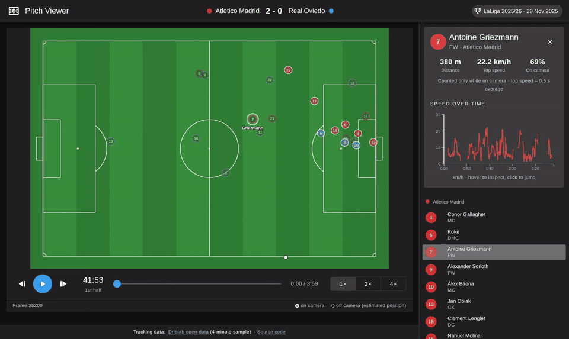

# Pitch Viewer

Replay a real football match from **Driblab's open tracking data**: 22 players and the ball
animated at 10 FPS on a pitch drawn to scale, with per-player distance, top speed and a speed chart.

**Live demo:** https://jamoussir1.github.io/pitch-viewer/



## What it does

- **Pitch to scale** (105 × 68 m) drawn in SVG with D3 scales: lines, boxes, centre circle, penalty arcs.
- **Playback** of Atlético Madrid 2-0 Real Oviedo (LaLiga 2025/26, 4-minute sample): play/pause,
  time slider, 1×/2×/4× speed, match clock. Movement is interpolated between the 10 FPS frames,
  so it stays smooth at 60 FPS.
- **Player panel**: pick a player from the list or click him on the pitch to see
  - distance covered and top speed, computed from x/y positions,
  - share of time on camera,
  - a D3 line chart of his speed over time, with a marker that follows playback
    (hover to inspect, click to jump).
- **Honest data handling**: positions flagged `vis: false` (off camera, estimated) are drawn
  as dashed rings and excluded from stats; impossible speeds (> 36 km/h) are treated as
  tracking glitches; missing or junk ball positions are hidden.

## Stack

|         |                                                                        |
| ------- | ---------------------------------------------------------------------- |
| UI      | Vue 3 (Composition API, `<script setup>`), TypeScript, Vuetify 3       |
| Charts  | D3 v7 (scales, line and path generators, axes)                         |
| State   | Pinia (playback position, play/pause, speed, selected player)          |
| Tooling | Vite, Vitest, ESLint + Oxlint, Prettier                                |
| CI/CD   | GitHub Actions: lint, type-check, tests, build, deploy to GitHub Pages |

## How it works

```
public/data/683253_sample.jsonl     (trimmed sample, JSON Lines)
        │ fetch
useMatchData() ── parseTrackingJsonl() ──► { info, players, frames }
        │
App.vue ── Pinia playback store ◄── usePlayback() (requestAnimationFrame loop)
   │            ▲
   │ props      │ events (select, seek)
   ├── PitchView.vue        pitch + players + ball (D3 computes, Vue renders)
   ├── PlaybackControls.vue play/pause, slider, speed, clock
   └── PlayerPanel.vue      list + stats ── SpeedChart.vue (D3 line + D3-owned axes)
```

```
src/
├── components/   PitchView, PlaybackControls, PlayerPanel, SpeedChart
├── composables/  useMatchData (load + parse), usePlayback (rAF loop)
├── stores/       playback (Pinia)
├── utils/        pure functions: parseTracking, stats, interpolate, pitch, format (+ tests)
└── types/        tracking data types
scripts/          explore-data.mjs, make-sample.mjs (Node, streaming)
```

**Design choices**

- _Vue renders, D3 computes_: D3 provides scales and path strings, Vue's template renders the SVG.
  Only the chart axes are handed to D3 through template refs.
- _SVG, not Canvas_: 23 moving elements is light for SVG, and every player stays clickable.
  For thousands of points (whole-match heatmaps, many matches) I would move that layer to Canvas.
- _Frames in a `shallowRef`_: 2,400 frames × 22 players are never mutated, so Vue does not need
  to make them deeply reactive.
- _Stats are pure functions_ in `utils/stats.ts`, unit-tested with Vitest.

## Run it locally

Requires Node 22.18+ or 24.

```bash
git clone https://github.com/jamoussir1/pitch-viewer.git
cd pitch-viewer
npm install
npm run dev        # http://localhost:5173
npm test           # unit tests
npm run build      # type-check + production build
```

### Rebuild the sample from the full match file (optional)

The full files are about 140 MB each and stored with Git LFS, so they are not in this repo.

```bash
mkdir -p data-raw
curl -L -o data-raw/683253_tracking_data.jsonl \
  "https://media.githubusercontent.com/media/driblab/open-data/670df4a4356c66bc1a35d25f8a569107228aef5e/dataset-1/683253_tracking_data.jsonl"
npm run explore -- data-raw/683253_tracking_data.jsonl   # metadata, ranges, visibility, units check
npm run sample  -- data-raw/683253_tracking_data.jsonl --start-min 42 --minutes 4
```

## Data and credit

Tracking data © **[Driblab](https://www.driblab.com)**, from the
[driblab/open-data](https://github.com/driblab/open-data) repository (`dataset-1`, 2025 season).
That repository has no explicit license, so this project only includes a **4-minute trimmed
sample** of one match (`public/data/683253_sample.jsonl`) for demonstration, and links back to
the source. All rights to the data remain with Driblab.

Coordinates are in metres on a 105 × 68 pitch with the origin at the top-left corner
(x to the right, y downwards), as documented in the source repository and checked with
`scripts/explore-data.mjs`.

## What I'd add next

- **Heatmap** of the selected player with a D3 sequential colour scale (Canvas layer).
- **Match picker** for all 10 matches, loading samples on demand.
- **Off-camera estimates** shown separately ("measured + estimated distance").
- **Team shape**: convex hull and average positions per team.
- **Keyboard shortcuts** (space, arrow keys) and a shareable URL with time and player.
- **Web Worker** to compute stats for full 90-minute matches without blocking the UI.

---

Built by [@jamoussir1](https://github.com/jamoussir1) as a learning project.
